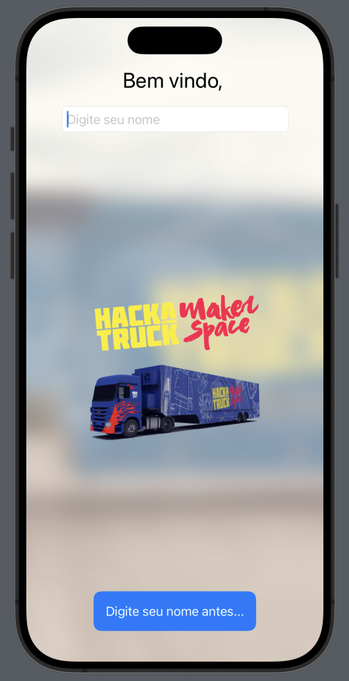
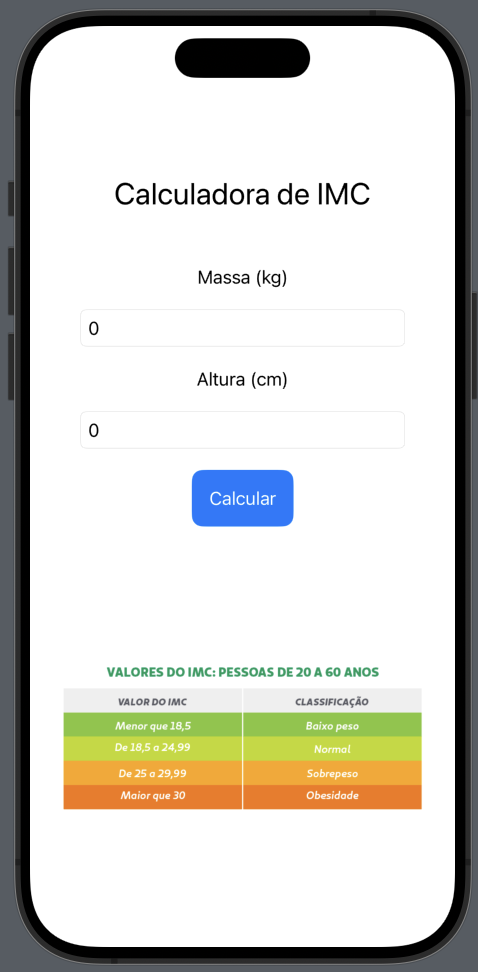
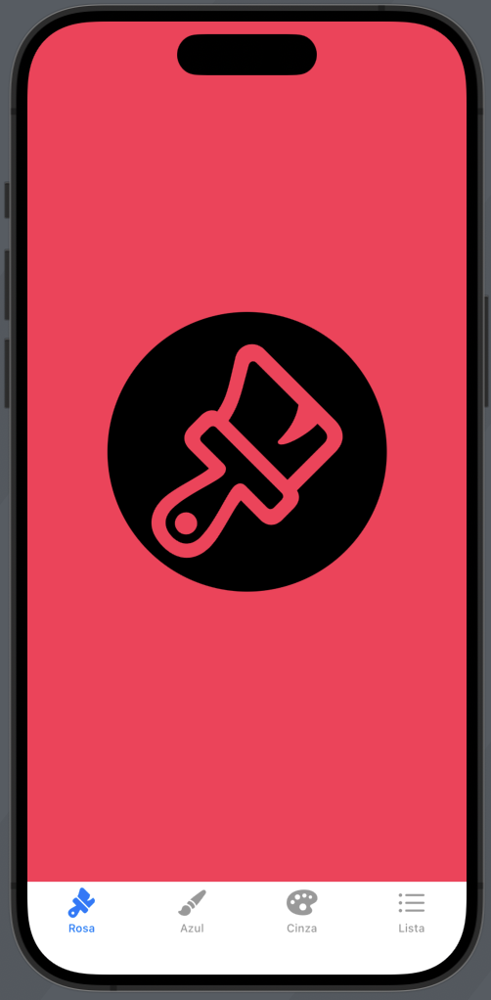
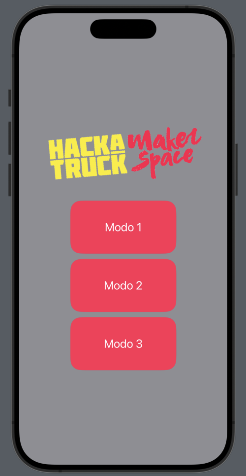
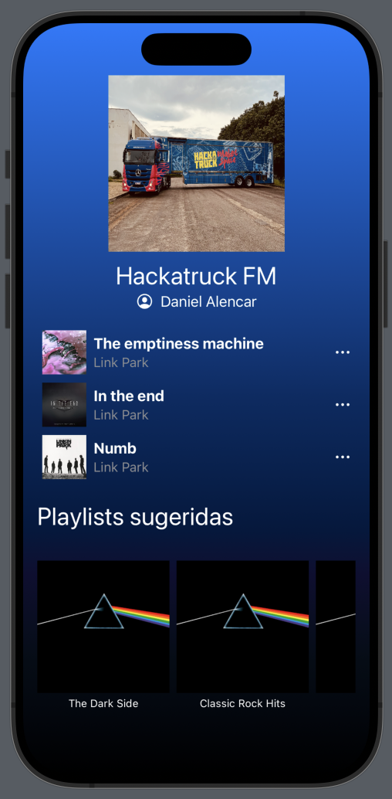
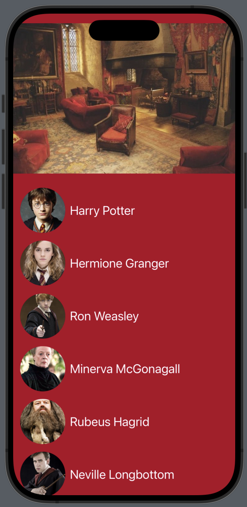
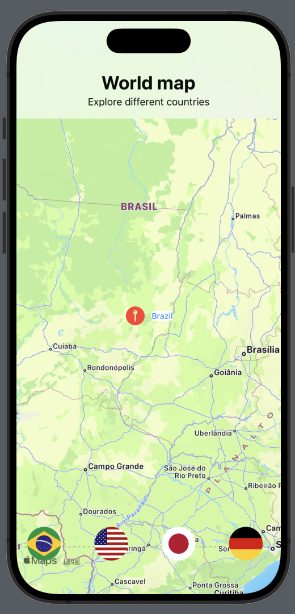

<h1 align="center">
  Projetos Swift
</h1>

<p align="center">
 <a href="#objetivo">Objetivo</a> •
 <a href="#apps">Apps</a> • 
 <a href="#autor">Autor</a>
</p>

## Objetivo

<p align="">
  Tenho o prazer de lhes apresentar os projetos em Swift UI que foram desenvolvidos em um período de poucas semanas no projeto Hackatruck.
</p>

## Apps

### Página de alerta
<p align="center">
  <div style="display: flex; flex-wrap: wrap;">
    
  <div>
</p>

### Calculadora de IMC
<p align="center">
  <div style="display: flex; flex-wrap: wrap;">
    
  <div>
</p>

### TabNavigation
<p align="center">
  <div style="display: flex; flex-wrap: wrap;">
    
  <div>
</p>

### StackNavigation
<p align="center">
  <div style="display: flex; flex-wrap: wrap;">
    
  <div>
</p>

### Player de música
<p align="center">
  <div style="display: flex; flex-wrap: wrap;">
    
  <div>
</p>

### Consumo de API de Harry Potter
<p align="center">
  <div style="display: flex; flex-wrap: wrap;">
    
  <div>
</p>

### Navegação em Mapas
<p align="center">
  <div style="display: flex; flex-wrap: wrap;">
    
  <div>
</p>

### Conceitos aprendidos

- [x] Componentes básicos
- [x] Estrutura do Swift UI
- [x] Navegação de telas (Tab e Stack)
- [x] SheetView
- [x] Player de músicas local
- [x] Consumo de API
- [x] Desenvolvimento de mapas

## Autor


Feito por Daniel Alencar! 
Entre em contato!

[](https://www.instagram.com/daniel_alencar_/) [](https://www.linkedin.com/in/Daniel746/) [](mailto:danielalencar746@gmail.com)

## Outros

# 🇮🇧🇲 🚚 Hackatruck Swift Project  🏆

Bem-vindo ao meu repositório do projeto Hackatruck. Este espaço será utilizado para documentar meu progresso e compartilhar o conhecimento adquirido durante o curso de desenvolvimento em Swift.
 

## Sobre o Projeto

O Hackatruck é uma iniciativa educacional que visa capacitar desenvolvedores no ecossistema Swift. Organizado pelo Instituto Eldorado, o Hackatruck é um laboratório tecnológico itinerante que capacita em desenvolvimento Swift, iOS, Cloud Services, serviços cognitivos e IoT.

<p align="center">
  
</p>

## 🗃️ Estrutura do Repositório

- **1 - View**: Página inicial com conceitos introdutórios e visualização.
- **2 - IMC**: Desenvolvimento de uma calculadora de IMC.
- **3 - TabView**: Projeto para aprender Navigation Stack.
- **4 - Navigation**: Projeto unindo Navigation Stack, NavigationLink e SheetViews.
- **5 - API**: Clone do Spotify, usando conceitos de Navigation Stack, variáveis e laços de repetição.
- **6 - Mapas**: Maps, entendendo mais sobre o Maps no SwiftUI.
- **7 - Spotify**: Rest, requisões à APIs com Swift.

## Como Executar

1. Certifique-se de ter o [Xcode](https://developer.apple.com/xcode/) instalado.
2. Clone o repositório:
   ```bash
   git clone https://github.com/aureliodeboa/Hack-Truck.git
   ```
3. Navegue até a pasta do projeto desejado e abra o arquivo `.swift` no Xcode.
4. Execute o código diretamente no Xcode.

## Resultados


https://github.com/user-attachments/assets/1ad7b246-0b51-4ffa-b65a-412ea07749bb

https://github.com/user-attachments/assets/4ba6d16c-72e9-4d0b-bb20-5587dbda4f7b

https://github.com/user-attachments/assets/cf676c49-984e-40e3-9dfd-24f950a172a9

https://github.com/user-attachments/assets/d6924bb4-23a1-412d-9261-d5b18f23ffd4

https://github.com/user-attachments/assets/b54f897e-2f56-410d-bd4c-d610c945eb66

https://github.com/user-attachments/assets/8275756f-48d5-4065-abba-c319291f9862

https://github.com/user-attachments/assets/6c11b5fe-f444-4127-acf7-e3df5b2428a2

